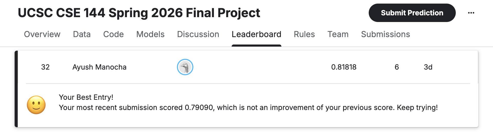

# CSE 144 Final Project: Transfer Learning Challenge

**Ayush Manocha** · Spring 2026

Kaggle public leaderboard score: **0.818**

## Leaderboard

## Model Weights

Download `best.pt` from Google Drive: https://drive.google.com/file/d/1Eq4mfeRNwVYLfMUGifXY4NiRDxy0fELC/view?usp=sharing

Place it at `MyDrive/ucsc-cse-144-spring-2026-final-project/checkpoints/best.pt`

## Running the Notebook

Open `CSE144FinalProject.ipynb` in Google Colab with a **T4 GPU runtime** and run all cells in order. This handles both training and inference. The final cells load the best checkpoint and write `submission.csv`.

To run inference only, skip the training loop cell and start from the *"Load best weights and predict"* cell near the bottom.

**Requirements:** dataset in Google Drive at `MyDrive/ucsc-cse-144-spring-2026-final-project/` with `train/`, `test/`, and `sample_submission.csv`. Dependencies installed automatically via `pip install -q timm`.
